# Bank System Assignment of Group6

It is an assignment project using C++. We implemented in **2017**.

# Installation

IDE: Turbo c++

# Login as Default Admin:

- username: **admin**
- password: **admin**

# Feature

Login Page:

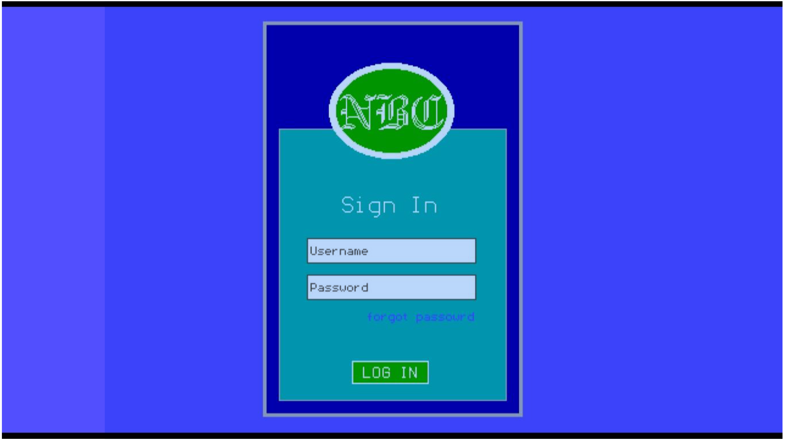

About Group:

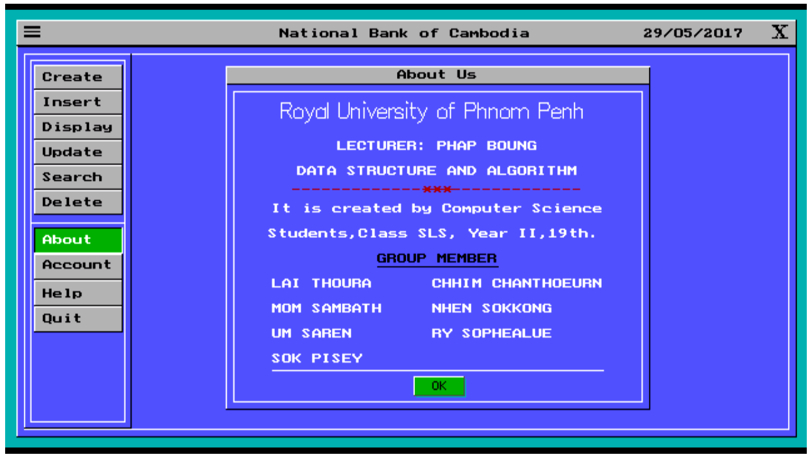

Account Management:

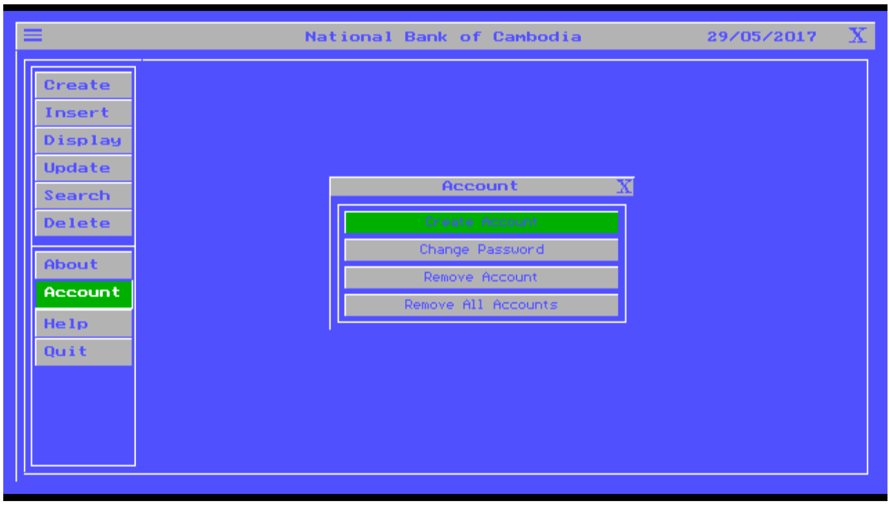

Help?

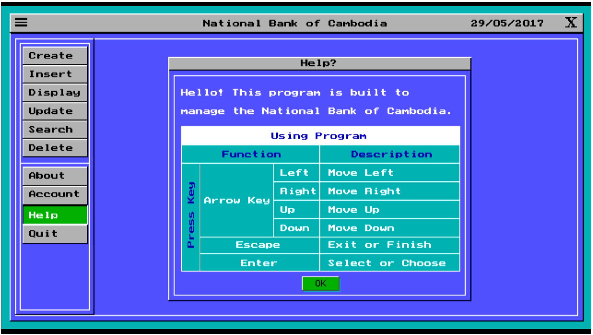

Create Customer:

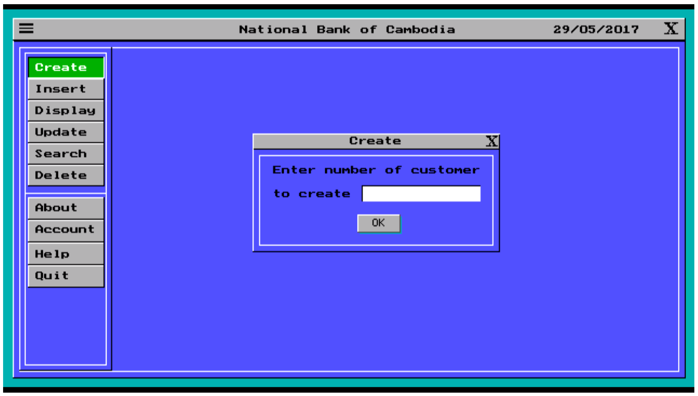

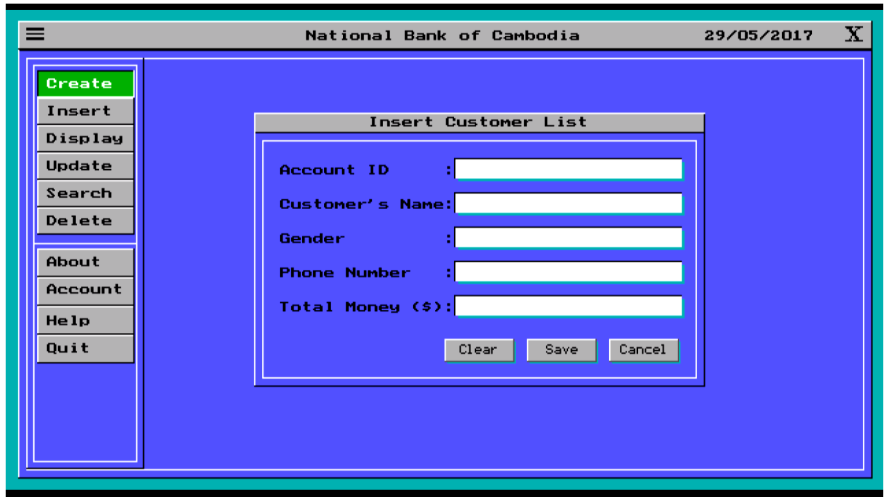

View Customers:

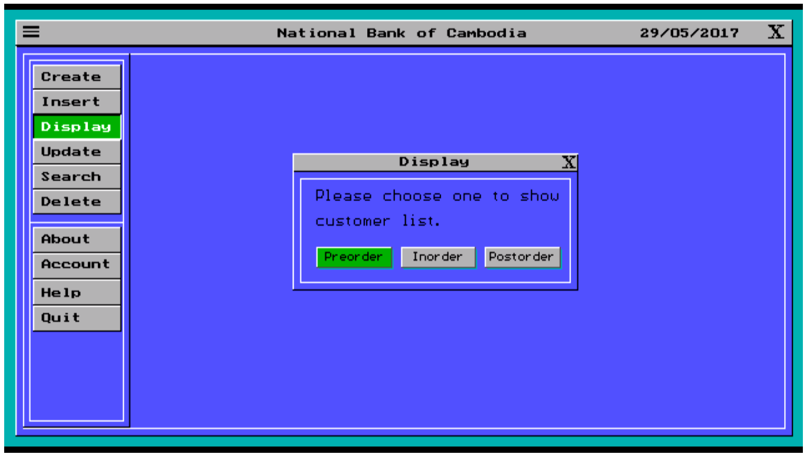

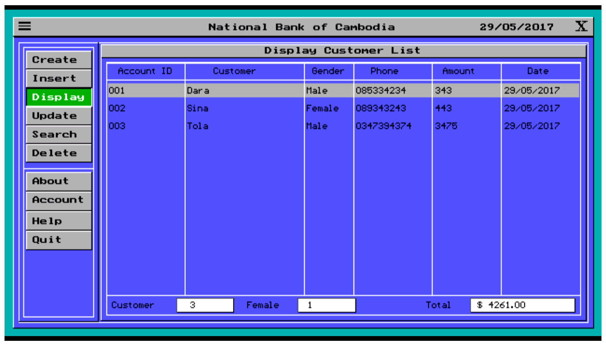

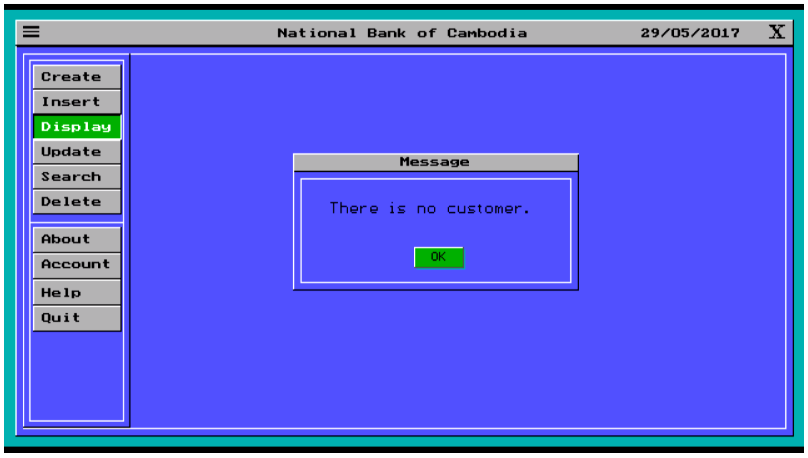

Update Customer:

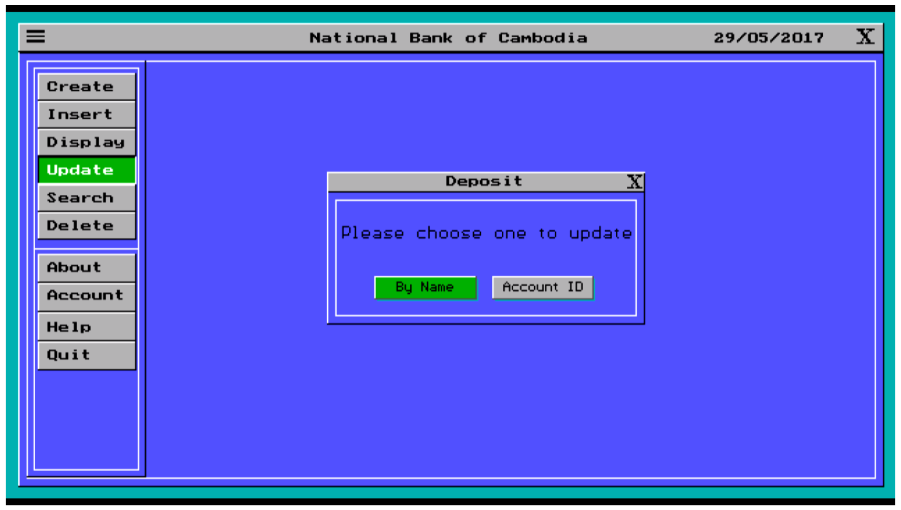

Delete Customer:

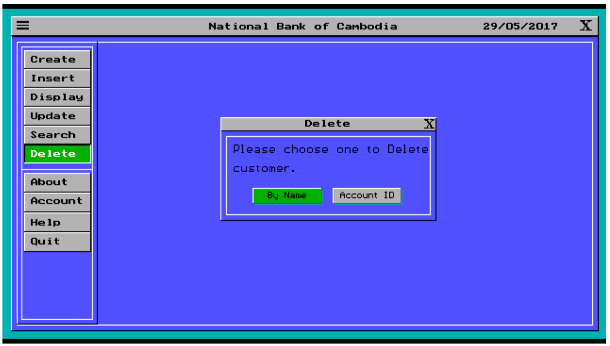

Exit Application:

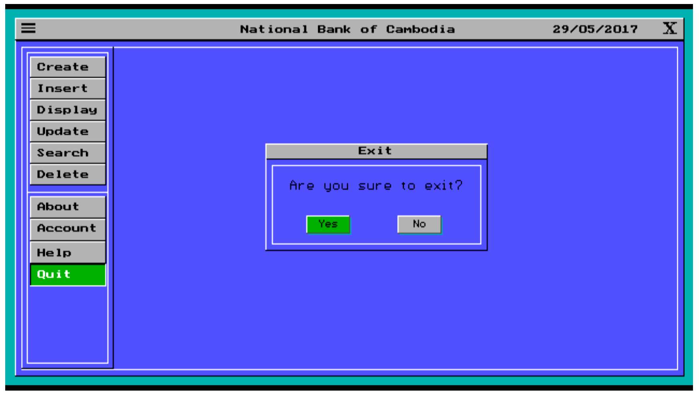